# wilmerlapuz.com – Portfolio & Live Dashboard

A glass-morphic, **Next.js + TypeScript** portfolio that doubles as a real-time
dashboard for my coding, fitness, language-learning and music activity.
Everything you see in **Stats** are generated automatically by GitHub Actions every hour and
deployed to Vercel in seconds.

| Live Site | Tech Stack | License |
|-----------|------------|---------|
| <https://wilmerlapuz.com> | Next 15 • React 19 • Tailwind CSS v4 • Framer Motion • Vercel | MIT |

---

## Table of Contents

- [Features](#features)
- [Architecture](#architecture)
- [Getting Started](#getting-started)
- [Available Scripts](#available-scripts)
- [Folder Structure](#folder-structure)
- [Roadmap](#roadmap)
- [Contributing](#contributing)
- [License](#license)

---

## Features

- **Live Metrics**  
  - WakaTime coding stats  
  - Strava running distance & latest run  
  - Spotify now-playing / recent track  
  - LeetCode problem-solving progress  
  - Anki Japanese deck breakdown  

- **Automated Data Pipeline**  
  - **GitHub Actions** workflow runs hourly  
  - Fetches data from 5 APIs, normalises to JSON and commits to `public/*.json`  
  - Zero-downtime Vercel deploy on push  

- **Fully Responsive UI**  
  - Desktop sidebar + mobile bottom-nav with smooth-scroll  
  - Bento-grid for stats (drag-n-drop ready)  
  - Glassmorphism powered by `oklch()` colour space and Tailwind CSS plugins  

- **Accessibility & Performance**  
  - Lighthouse ≥ 95 on all categories  
  - Semantic HTML + aria labels  
  - Optimised images via `next/image`  

- **DX First**  
  - Strict TypeScript (`noUncheckedIndexedAccess`, etc.)  
  - ESLint, Prettier & Husky pre-commit hooks  
  - Hot reload with `next dev`  

---

## Architecture

```mermaid
graph LR
    A[⏰ GitHub Actions] --> B[📊 Aggregator]
    B --> C[📁 JSON Files] 
    C --> D[⚡ Next.js]
    D --> E[🎨 React UI]
    
    style A fill:#2563eb,stroke:#3b82f6,stroke-width:2px,color:#fff
    style B fill:#059669,stroke:#10b981,stroke-width:2px,color:#fff
    style C fill:#dc2626,stroke:#ef4444,stroke-width:2px,color:#fff
    style D fill:#7c3aed,stroke:#a855f7,stroke-width:2px,color:#fff
    style E fill:#7c3aed,stroke:#a855f7,stroke-width:2px,color:#fff
```




- **Data layer** – simple JSON files; no server/database required
- **UI layer** – statically generated at build time, hydrated client-side for
  animations and live re-fetch
- **Deployment** – Vercel preview per PR + production on `main`

---

## Getting Started

1. **Clone**

   ```bash
   git clone https://github.com/wlmr-rk/wilmerlapuz.com.git
   cd wilmerlapuz.com
   ```

2. **Install deps**

   ```bash
   pnpm install   # or yarn / npm
   ```

3. **Run locally**

   ```bash
   pnpm dev
   # visit http://localhost:3000
   ```

There are no secret API keys required for local development; the demo JSON
files under `/public` are enough.  
To fetch fresh data locally, run:

```bash
pnpm fetch:stats   # executes the same script used in CI
```

---

## Available Scripts

| Command | Description |
|---------|-------------|
| `pnpm dev` | Run in dev mode with fast refresh |
| `pnpm build` | Production build |
| `pnpm fetch:stats` | Pull latest data from external APIs |
| `pnpm lint` | ESLint + TypeScript check |
| `pnpm format` | Prettier auto-format |

---

## Folder Structure

```
.
├─ app/                # Next.js App Router
│  ├─ page.tsx
│  ├─ layout.tsx
│  └─ ...
├─ components/         # Re-usable UI/section components
├─ hooks/              # React hooks (e.g. useStats)
├─ public/             # Auto-generated JSON + static assets
├─ scripts/            # GitHub Action data fetchers
├─ types/              # Shared TypeScript types
```

---

## Roadmap

- [ ] Dark-/light-mode toggle  
- [ ] i18n (🇯🇵 translations)  
- [ ] Drag-to-reorder bento widgets (persisted to `localStorage`)  
- [ ] Add **Rust** & **Kotlin** project showcases  
- [ ] Lighthouse CI & unit tests (Vitest + React Testing Library)  

---

## Contributing

Pull requests are welcome!  
If you spot a bug or want a new stat source:

- Fork → create branch → commit → open PR

---

## License

MIT © Wilmer Lapuz  
See [`LICENSE`](./LICENSE) for details.
